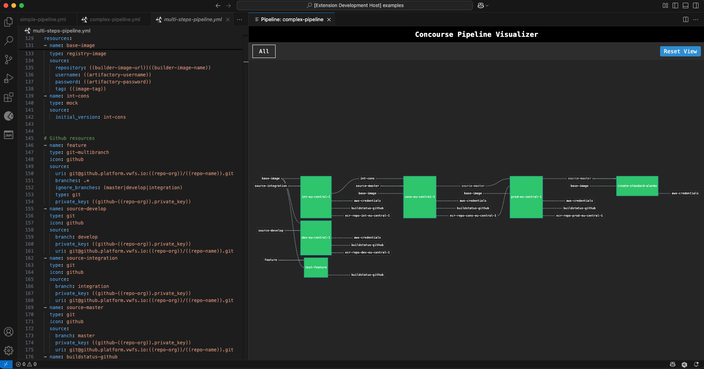

# Concourse Pipeline Visualizer for VS Code

A VS Code extension for previewing Concourse CI pipeline files directly in your editor. Visualize your pipeline structure, groups, and dependencies with an interactive D3.js rendering.



## Features

- Live preview of Concourse pipeline YAML files
- Interactive visualization with pan and zoom controls
- Support for pipeline groups with tabbed navigation
- Automatic updates as you edit your YAML files
- Works with both simple pipelines and complex grouped pipelines
- Clean, Concourse-style dark theme UI

## Requirements

- VS Code 1.60.0 or higher

## Installation

### From VSIX file (direct sharing)

1. Download the .vsix file from the releases or from a shared location
2. Install the extension in VS Code:
   - Option 1: Run `code --install-extension concourse-vscode-viz-0.1.0.vsix` in your terminal
   - Option 2: In VS Code, go to Extensions view → Click "..." → "Install from VSIX..." → Select the downloaded file

### From VS Code Marketplace (coming soon)

Search for "Concourse Pipeline Visualizer" in the VS Code extensions marketplace and click install.

## Usage

1. Open a Concourse pipeline YAML file in VS Code
2. Run the command "Show Concourse Pipeline Preview" from the Command Palette (Ctrl+Shift+P or Cmd+Shift+P) or click on the "Open Preview" icon
3. The preview will open in a side panel and update as you edit
4. Use group tabs to view different sections of your pipeline
5. Use the Reset View button to reset the zoom level

## Building from Source

If you want to build the extension from source:

```bash
# Clone the repository
git clone https://github.com/wbkurniawan/concourse-vscode-viz.git

# Install dependencies
cd concourse-vscode-viz
npm install

# Install vsce if you don't have it
npm install -g @vscode/vsce

# Compile the extension
npm run compile

# Package the extension
npm run package
```

## Sharing with Your Team

To share this extension with your team without publishing to the marketplace:

1. Build the VSIX package: `npm run package`
2. Share the resulting `.vsix` file with your team members
3. They can install it using the instructions in the Installation section

## Known Issues

- Large pipeline files might affect performance
- Some complex Concourse pipeline features may not be fully supported

## Release Notes

### 0.1.0

Initial release of the Concourse Pipeline Visualizer for VS Code:
- Basic visualization of Concourse pipelines
- Support for pipeline groups
- Interactive pan and zoom controls
- Real-time updates as you edit
- Dark theme UI to match Concourse style

## Contributing

Contributions are welcome! Please feel free to submit a Pull Request.